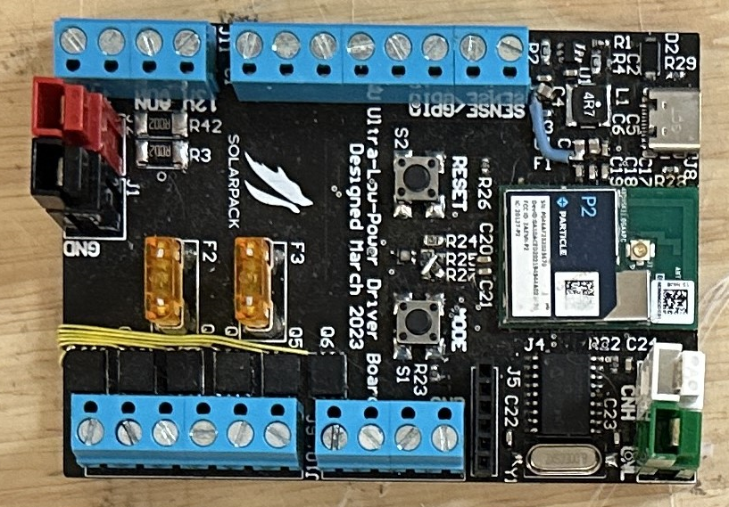
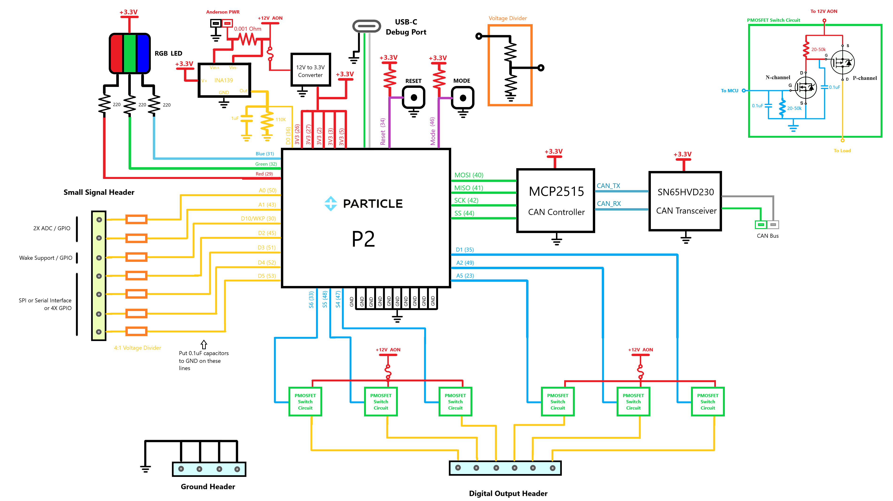
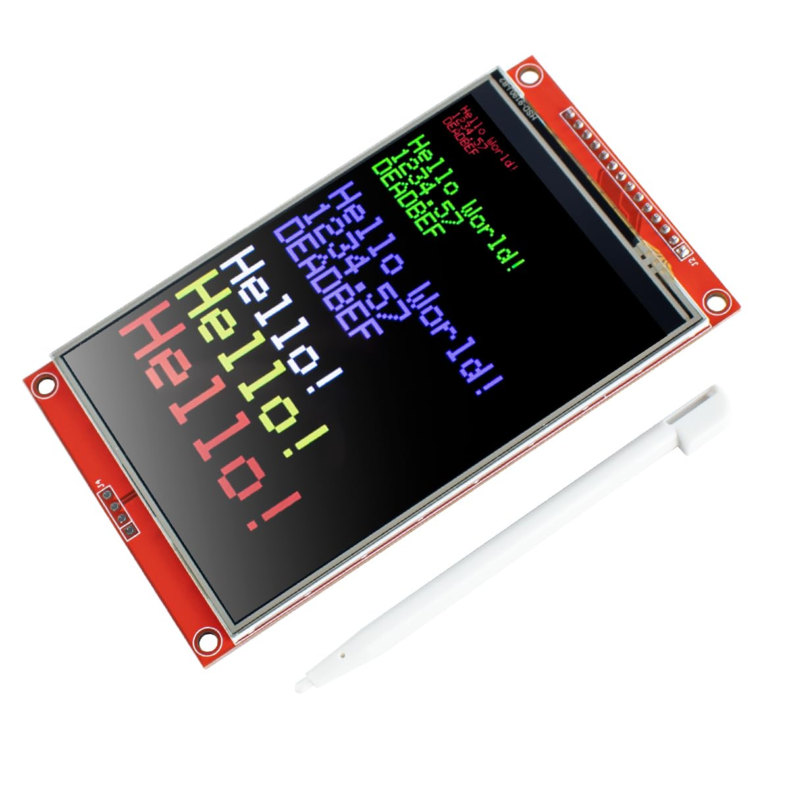
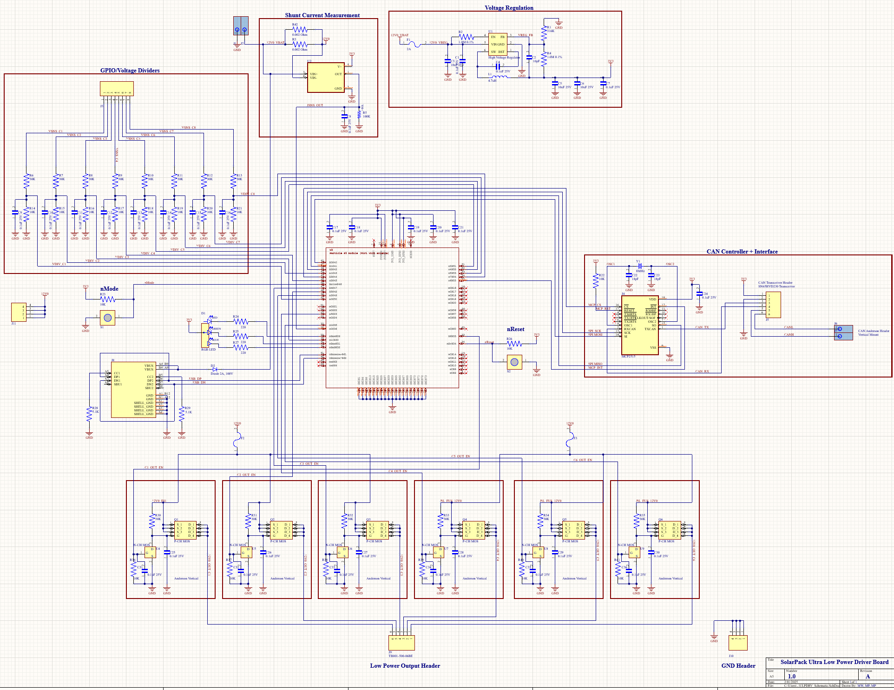
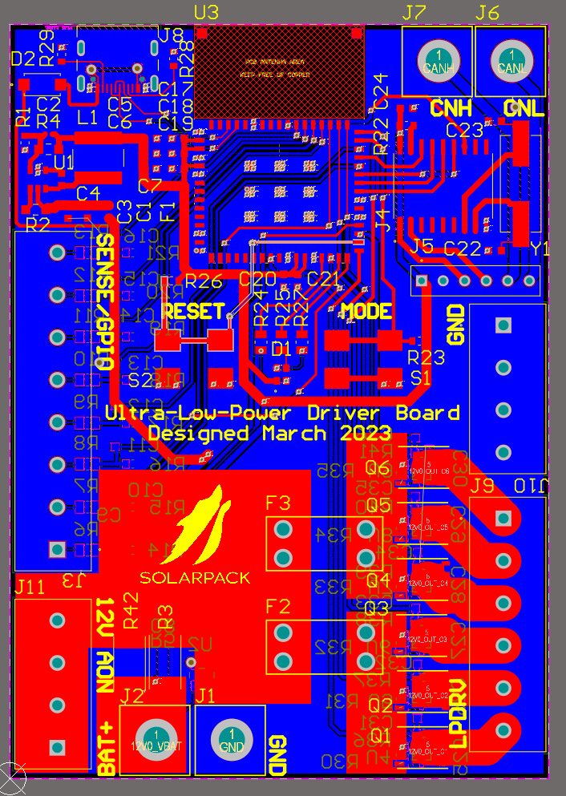

# DecentralizedLV-ULPDRV
Software Repository for Ultra Low Power Driver Board, a second revision to the Low Power Driver Board

## Project Overview

The DecentralizedLV Ultra-Low-Power Driver Board (ULPDRV) has the primary role of powering the accessories in the vehicle similar to the normal [Low-Power Driver Board](https://github.com/matthewpanizza/DecentralizedLV-LPDRV). One LPDRV/ULPDRV board is placed on each corner of the vehicle and is connected to accessory components such as lights, cooling fans, and cooling pumps. It determines if those are accessories should be powered based on CAN Bus messages it receives from the [DecentralizedLV Dash Controller](https://github.com/matthewpanizza/DecentralizedLV-DashController) and [DecentralizedLV Power Controller](). See the main [DecentralizedLV-Documentation](https://github.com/matthewpanizza/DecentralizedLV-Documentation) repository for information about the DecentralizedLV system and how to set up the software environment for programming this board.

## Block Diagram

## Errata
On the original version of the PCB of this board, there are missing vias in the low-power driver pins between the N-Channel MOSFETs source pins and the P-Channel MOSFETs gate pins. Small jumper wires must be run to repair this fault. Additionally, a ground connection is missing on the voltage regulation capacitors. See the image for what the repairs look like.

## Hardware Capabilities
- 3X fused PWM-Capable [Low-power driver pins](https://github.com/matthewpanizza/DecentralizedLV-Documentation?tab=readme-ov-file#low-power-output-pins-supply-power-to-low-power-devices-less-than-5-amps) (A5, A2, D1) (P-MOSFET Configuration)
- 3X fused Non-PWM [Low-power driver pins](https://github.com/matthewpanizza/DecentralizedLV-Documentation?tab=readme-ov-file#low-power-output-pins-supply-power-to-low-power-devices-less-than-5-amps) (S6, S5, S4) (P-MOSFET Configuration)
- 8X [Sense Pins](#https://github.com/matthewpanizza/DecentralizedLV-Documentation?tab=readme-ov-file#sense-pins-read-binary-onoff-switches-or-12v-signals) (4:1 voltage divider ratio), reconfigurable for special functions
- 1X [SPI Interface (Special Function)](#spi-peripheral-control-with-sense-pin-jumper-bypass) for control of TFT LCDs or other SPI peripherals. Requires jumper bypass of four of the [Sense Pins](#https://github.com/matthewpanizza/DecentralizedLV-Documentation?tab=readme-ov-file#sense-pins-read-binary-onoff-switches-or-12v-signals)
- 1X [UART Interface (Special Function)](#uart-peripheral-control-with-sense-pin-jumper-bypass) for controlling Serial/UART peripherals. Requires jumper bypass of two of the [Sense Pins](#https://github.com/matthewpanizza/DecentralizedLV-Documentation?tab=readme-ov-file#sense-pins-read-binary-onoff-switches-or-12v-signals)
- Ability to go into [Sleep Mode](https://docs.particle.io/reference/device-os/firmware/#sleep-sleep-) with wake via the Sense Pin connected to D10
- 4X 12V passthrough header to connect to switches for feeding to [Sense Pins](#https://github.com/matthewpanizza/DecentralizedLV-Documentation?tab=readme-ov-file#sense-pins-read-binary-onoff-switches-or-12v-signals)
- 4X GND passthrough header to connect negative terminal of devices powered with [Low-power driver pins](https://github.com/matthewpanizza/DecentralizedLV-Documentation?tab=readme-ov-file#low-power-output-pins-supply-power-to-low-power-devices-less-than-5-amps)

## Important Roles
- Responsible for distributing power received from the Power Controller to the majority of accessory components (lights, pumps, fans) in the low-voltage electrical system
- Has the capability to read in 12V signals using [Sense Pins](#https://github.com/matthewpanizza/DecentralizedLV-Documentation?tab=readme-ov-file#sense-pins-read-binary-onoff-switches-or-12v-signals) and passing that information to other places in the vehicle

### CAN Bus Communication

CAN Bus communication is handled using the [DecentralizedLV-Boards API](https://github.com/matthewpanizza/DecentralizedLV-Boards) submodule for sending and receiving messages. The submodule also has the CAN message encoding and decoding for this board and other boards in the system. Check out the [Boards API LPDRV section](https://github.com/matthewpanizza/DecentralizedLV-Boards?tab=readme-ov-file#lpdrv_rearleft_can) for the CAN message encoding. Check out the [DecentralizedLV-Documentation](https://github.com/matthewpanizza/DecentralizedLV-Documentation) repository for information about CAN Bus communication.

 
### SPI Peripheral Control (with Sense Pin Jumper Bypass)

Four of the sense pins (D2, D3, D4, D5) can be bypassed with a jumper to expose microcontroller pins that support a SPI bus. See the [Particle Reference Doc](https://docs.particle.io/reference/device-os/firmware/#spi) for more information about SPI. The `SPI` method is used by the primary SPI bus used to communicate with the MCP2515 CAN Bus controller, while these pins are used by the `SPI1` method. Here is an example of a [SPI TFT LCD](https://randomnerdtutorials.com/guide-to-1-8-tft-display-with-arduino/). For example, you could place one of these LCDs near the J1772 EV charge port and display live information about the battery pack voltage and other telemetry.

**Noteworthy Information**: Peripheral libraries, such as those used for TFT LCDs and the MCP2515 CAN Controller, likely assume that you are using the primary SPI Bus (`SPI`) and not the secondary (`SPI1`). You may need to modify the library to use `SPI1` instead! Some libraries support passing in a reference to which SPI bus you wish to use - go check out the guts of any library you use for SPI.

**Important**: In order to use SPI peripherals, you must directly pass the microcontroller pin to the Sense Pin terminal block. This is done by removing the respective resistors and connecting the two pads directly with solder. Also remove the other resistors and capacitors associated with those four Sense Pins. See the PCB boardview below for the positions of the mentioned resistors.

### UART Peripheral Control (with Sense Pin Jumper Bypass)

Two of the sense pins (D4, D5) can be bypassed with a jumper to expose microcontroller pins that support Serial communication. See the [Particle Reference Doc](https://docs.particle.io/reference/device-os/firmware/#serial) for more information about Serial. The `Serial` method is the serial console exposed to the USB port (when you connect your computer). The `Serial2` method is the one exposed by these pins.

**Important**: In order to use UART peripherals, you must directly pass the microcontroller pin to the Sense Pin terminal block. This is done by removing the resistors R11 and R12 and connecting the two pads directly with solder. Also remove the other resistors and capacitors associated with those two Sense Pins. See the PCB boardview below for the positions of the mentioned resistors.

### PCB Schematic / Boardview

